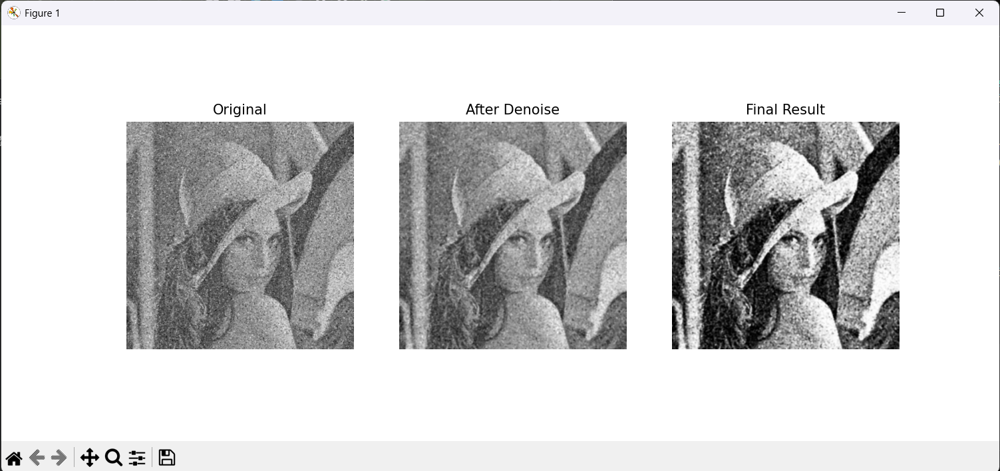

# Mini Project 1 — Image Restoration: Lena

Repositori ini berisi implementasi manual pengolahan citra menggunakan pustaka NumPy di Python untuk merestorasi citra "Lena" yang mengalami degradasi berupa *low contrast*, *Gaussian noise*, *salt-and-pepper noise*, dan *blur*. Proyek ini disusun untuk memenuhi tugas mata kuliah Pengolahan Citra dan Video.

---

## 1. Identitas
* **Nama:** Amos Harol Turnip
* **NRP:** [Masukkan NRP Anda di sini]
* **Departemen:** Teknik Komputer, Institut Teknologi Sepuluh Nopember

---

## 2. Penjelasan Pipeline Restorasi

Sesuai dengan batasan tugas, seluruh proses *filtering*, *histogram*, dan transformasi diimplementasikan secara **manual menggunakan NumPy** tanpa menggunakan fungsi *processing* bawaan dari OpenCV. 

Berikut adalah urutan *pipeline* yang digunakan beserta alasannya:

1. **Denoising 1: Median Filter (Kernel 3x3)**
   * **Tujuan:** Menghilangkan *salt-and-pepper noise*.
   * **Alasan:** Median filter sangat efektif untuk mengatasi *impulse noise* (titik hitam/putih ekstrem) tanpa merusak garis tepi (*edges*) gambar. Ukuran kernel 3x3 dipilih agar tekstur asli citra (seperti bulu pada topi) tidak ikut terhapus atau menjadi terlalu *blur*.
2. **Denoising 2: Gaussian Filter (Kernel 3x3, Sigma 1.0)**
   * **Tujuan:** Menghaluskan sisa *Gaussian noise*.
   * **Alasan:** Setelah *salt-and-pepper* hilang, filter linear (Gaussian) digunakan untuk meratakan sisa bintik-bintik halus. Kernel kecil digunakan untuk menjaga ketajaman detail.
3. **Contrast Enhancement: Manual Histogram Equalization (HE)**
   * **Tujuan:** Memperbaiki rentang intensitas citra yang sempit (*low contrast*).
   * **Alasan:** HE meratakan distribusi nilai piksel. Implementasi manual ini juga menggunakan *masking* pada nilai nol untuk memastikan Cumulative Distribution Function (CDF) dinormalisasi dengan benar, sehingga gambar tidak menjadi terlalu *overexposed*.
4. **Sharpening: Unsharp Masking**
   * **Tujuan:** Mempertajam detail yang kabur akibat proses denoising dan degradasi awal.
   * **Alasan:** Dibandingkan menggunakan *Laplacian filter* yang cenderung memperkuat sisa *noise* menjadi bintik kasar, *Unsharp Masking* bekerja dengan cara menambahkan selisih detail (Citra Original - Citra Blurred) kembali ke citra aslinya. Hasilnya, tepi objek menjadi lebih tegas namun tetap natural.

---

## 3. Perbandingan Visual

| Input: Citra Rusak (Noisy) | Output: Citra Restorasi |
| :---: | :---: |
|  |  |


## 4. Analisis Singkat

* **Apa yang Berhasil:** Kombinasi *Median* dan *Gaussian filter* dengan ukuran kernel yang dijaga tetap kecil (3x3) berhasil membersihkan *noise* secara signifikan tanpa membuat gambar menjadi "botak" teksturnya. Penggunaan *Unsharp Masking* sebagai pengganti *Laplacian* terbukti sangat krusial untuk menjaga tekstur wajah Lena tetap halus sambil memperjelas garis mata dan topi.
* **Apa yang Bisa Ditingkatkan:** 1. **Komputasi Waktu:** Karena proses konvolusi dan pencarian median dilakukan secara manual menggunakan *nested loop* di Python, eksekusi program memakan waktu yang cukup lama. Optimalisasi bisa dilakukan menggunakan vektorisasi NumPy (`stride_tricks`).
  2. **Pemulihan Warna:** Program ini merestorasi kualitas citra dalam bentuk *grayscale*. Karena citra input (`lena_noisy.png`) di-load dalam skala abu-abu, informasi saluran warna RGB asli telah hilang dan tidak dapat dipulihkan dari citra tersebut.

---

## 5. Cara Menjalankan Program

**Prasyarat:**
Pastikan Anda telah menginstal pustaka yang dibutuhkan:
```bash
pip install numpy opencv-python matplotlib
